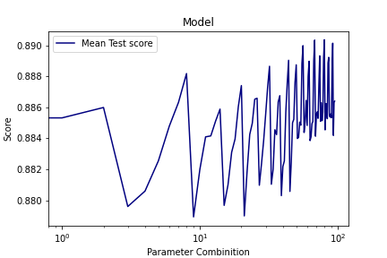
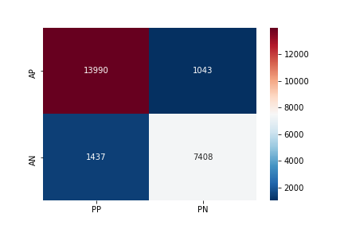
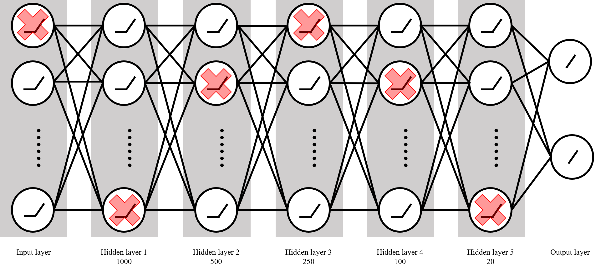
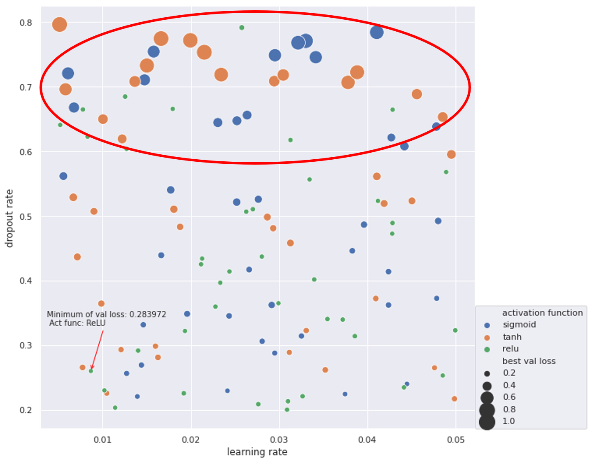
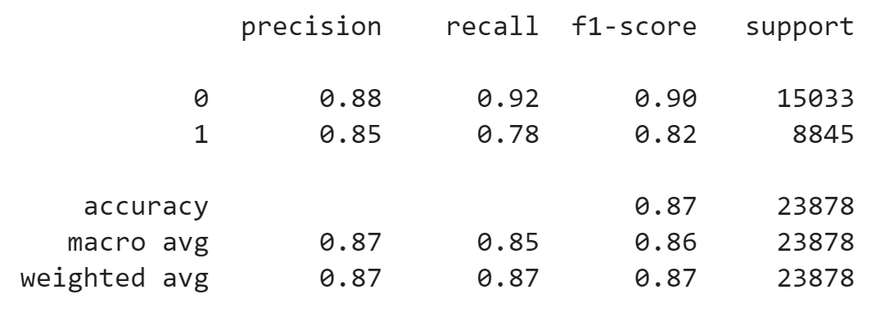
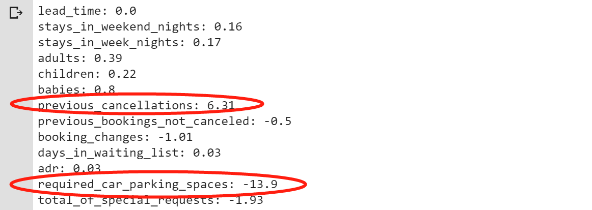

# Cancel or not? Predictive Analysis for Hotel Booking Data

> PHBS_MLF_2019_Project: [Course Link](https://github.com/PHBS/MLF)

[TOC]

## 0. Team members

| Group 13                                        | SID        |
| ----------------------------------------------- | ---------- |
| [Jingwei Gao](https://github.com/LobbyBoy-Dray) | 1801213126 |
| [Simon SHEN](https://github.com/Simon9511)      | 1801212832 |
| [Yingjie Jiang](https://github.com/Jason422)    | 1901212596 |
| [Rongxin Ouyang](https://github.com/oyrx)       | 1801213136 |

## 1. Project description

|       Project        |                           Details                            |
| :------------------: | :----------------------------------------------------------: |
|       **Goal**       | To predict whether a specific hotel booking will be cancelled |
|       **Data**       | [Hotel booking demand](https://www.kaggle.com/jessemostipak/hotel-booking-demand) on Kaggle |
|    **Data File**     |                     `hotel_bookings.csv`                     |
| **Data Description** | This data set contains booking information for a city hotel and a resort hotel, and includes information such as when the booking was made, length of stay, the number of adults, children, and/or babies, and the number of available parking spaces, among other things. |

Emerging network society issues new challenges on understanding big data in electronic consuming behaviors, as well as in hotel business. Significant differences can be easily found in tremendous reservation records, consisting of time, location, historic characteristics, and so on.

Considering oblivious risks by potential cancellation after reservation, the utilization of hotel booking data can be conducive to optimizing business decisions and strategies, nevertheless, also far from application without quantified nuances behind the topsoils.

## 2. Task, significance and process

**Project Task**  

* This project is proposed to use order information of multiple dimensions order to predict whether a specific order will be cancelled or not.

**Significance**  

* Before the user cancels the order, it is predicted whether the user will cancel the order, which is beneficial to the hotel and the reservation website to better allocate resources, improve the true utilization rate of resources, and maximize the revenue. The problem of overselling airline tickets by analog airlines, overselling airline tickets within a reasonable range, helps to achieve a balance between customer efficiency and company revenue, and achieves the most profit without harming the customer experience.

**Process**

* **Determine the data set**. There are a lot of open source data on kaggle, considering the significance of the topic and the difficulty of prediction, and finally select the hotel prediction topic.
* **Identify the problem**. Taking into account the hotel booking time, whether to cancel the order is of great significance to the hotel or the user. At the same time, the cancellation of the predetermined behavior and other variables in the data set have a causal relationship, so we determine the research direction to determine whether the user cancels the order,
* **Data exploration**. Correlation analysis of data and feature engineering processing of data sets using pca method.
* **Classical model (tree based)**. In this section, initially, we'll start with two classical baseline models, logistic regression and randomforest with default parameter, and then use boosting techniques to improve the performance of tree-based models in two efficient modern frameworks, LightGBM and XGBoost.
* **Deep learning model**. Although we have derived a nice result (i.e. high accuracy) from gradient boosting algorithms, we still want to know how the deep learning model performs in this task. We choose to use a simple feed-forward neural network as our deep learning model. We fix the network structure in advance and do some hyperparameter tuning to find whether it is possible to get a better result. At last, we use LIME to approximate a local explanation for our DL model.

## 3. Data exploration

> Incongruous exploration on the meanings of features was conducted before formal exploratory analysis.

### 1) Feature with meaning

- `hotelHotel`: (H1 = Resort Hotel or H2 = City Hotel)
- `lead_time`: Number of days that elapsed between the entering date of the booking into the PMS and the arrival date
- `arrival_date_year`: Year of arrival date
- `arrival_date_month`: Month of arrival date
- `arrival_date_week_number`: Week number of year for arrival date
- `arrival_date_day_of_month`: Day of arrival date
- `stays_in_weekend_nights`: Number of weekend nights (Saturday or Sunday) the guest stayed or booked to stay at the hotel
- `stays_in_week_nights`: Number of week nights (Monday to Friday) the guest stayed or booked to stay at the hotel
- `adults`: Number of adults
- `children`: Number of children
- `babies`: Number of babies
- `meal`: Type of meal booked. Categories are presented in standard hospitality meal packages: Undefined/SC – no meal package; BB – Bed & Breakfast; HB – Half board (breakfast and one other meal – usually dinner); FB – Full board (breakfast, lunch and dinner)
- `country`: Country of origin. Categories are represented in the ISO 3155–3:2013 format
- `market_segment`: Market segment designation. In categories, the term “TA” means “Travel Agents” and “TO” means “Tour Operators”
- `distribution_channel`: Booking distribution channel. The term “TA” means “Travel Agents” and “TO” means “Tour Operators”
- `is_repeated_guest`: Value indicating if the booking name was from a repeated guest (1) or not (0)
- `previous_cancellations`: Number of previous bookings that were cancelled by the customer prior to the current booking
- `previous_bookings_not_canceled`: Number of previous bookings not cancelled by the customer prior to the current booking
- `reserved_room_type`: Code of room type reserved. Code is presented instead of designation for anonymity reasons.
- `assigned_room_type`: Code for the type of room assigned to the booking. Sometimes the assigned room type differs from the reserved room type due to hotel operation reasons (e.g. overbooking) or by customer request. Code is presented instead of designation for anonymity reasons.
- `booking_changes`: Number of changes/amendments made to the booking from the moment the booking was entered on the PMS until the moment of check-in or cancellation
- `deposit_type`: Indication on if the customer made a deposit to guarantee the booking. This variable can assume three categories: No Deposit – no deposit was made; Non Refund – a deposit was made in the value of the total stay cost; Refundable – a deposit was made with a value under the total cost of stay.
- `agent`: ID of the travel agency that made the booking
- `company`: ID of the company/entity that made the booking or responsible for paying the booking. ID is presented instead of designation for anonymity reasons
- `days_in_waiting_list`: Number of days the booking was in the waiting list before it was confirmed to the customer
- `customer_type`: Type of booking, assuming one of four categories: Contract - when the booking has an allotment or other type of contract associated to it; Group – when the booking is associated to a group; Transient – when the booking is not part of a group or contract, and is not associated to other transient booking; Transient-party – when the booking is transient, but is associated to at least other transient booking
- `adr`: Average Daily Rate as defined by dividing the sum of all lodging transactions by the total number of staying nights
- `required_car_parking_spaces`: Number of car parking spaces required by the customer
- `total_of_special_requests`: Number of special requests made by the customer (e.g. twin bed or high floor)
- `reservation_status`: Reservation last status, assuming one of three categories: Canceled – booking was canceled by the customer; Check-Out – customer has checked in but already departed; No-Show – customer did not check-in and did inform the hotel of the reason why
- `reservation_status_date`: Date at which the last status was set. This variable can be used in conjunction with the ReservationStatus to understand when was the booking canceled or when did the customer checked-out of the hotel

### 2) Correlations and PCA

With the help of our [manual work](https://github.com/oyrx/PHBS_MLF_2019_Project/blob/master/code/Corrleations_And_Feature_Engineering.ipynb) and [pandas_profiling](https://github.com/oyrx/PHBS_MLF_2019_Project/blob/master/code/Exploration_Statistics.ipynb), we discern that:

* **Cramer's V model**: *Cramer's V model* based on the chi squared statistic that can show how strongly nominal variables are associated with one another. This is very similar to correlation coefficient where 0 means no linear correlation and 1 means strong linear correlation.
  * **Drop some features**: As we did before, two features ("reservation_status_date" & "reservation_status") are dropped for avoidance of leakage. In addition, we drop the feature "arrival_date_year" because we will use future information to predict future cancellation behavior.
  * **Results**: "deposit_type" showed the highest correlation with the target variable. The reservation_status_date effect was already looked at in the previous section where we saw an intersting trend that people cancel less during the winter time.
* **Numerical features's correlations**
  * **Drop some features**: re-convert "is_canceled" attribute to numerical values.
  * **Results**: both lead_time and total_of_special_requests had the strongest linear correlations with is_canceled target variable.
* **PCA analysis on categorical features**
  * **OneHotEncoding**: To convert categorical features to numerical ones using Scikit-learn. This requires running integer encoding first followed by OneHotEncoding.
  * **Results**: the principal component 1 holds 44.2% of the information while the principal component 2 holds only 32.9% of the information. Summing them up, we will have ~77% of information. We need about 8 components to represent 90% of the dataset.
  * Other details of each feature can be found at [descriptive report](https://github.com/oyrx/PHBS_MLF_2019_Project/blob/master/docs/Descriptive_Report.html).

## 4. Data cleaning

The prediction target of this study is the **is_canceled** indicator (0-1 variable), the data set contains a total of 31 dimensions of information. Among them, all 30 dimensions are discrete variables, and only **adr** (Average Daily Rate) is a continuous variable.

Because the data set owner has done preliminary data cleaning work, the data set quality is high. After statistics, it is found that there is no need to do too much data cleaning work, only a small amount of vacant values need to be filled. The data cleaning work done this time mainly includes:

- Fill the na value of the children factor. Considering that the children and babies factor have a small difference and the vacancy values of the children field are very few, they are filled directly with the babie field.
- The other fields with vacant values are all categorical fields. Here we want to retain as many features as possible, so fill in the vacant values as **'undefined'** and do not delete them.

## 5. Baseline and tree-based models

> This section contains two baseline models, LR and Random Forest, and other two moder boosting methods, Dart in LightGBM and GBDT in XGBoost.

### 1) Methodology

#### - What is GBDT and DART?

Gradient Boosted Decision Trees (GBDT) is a machine learning algorithm that iteratively constructs an ensemble of weak decision tree learners through boosting.

- For GBDT:

  - Feature selection is inherently performed during the learning process
  - Not prone to collinear/identical features
  - Models are relatively easy to interpret
  - Easy to specify different loss functions

- For DART:
  - Similar to GBDT but [may be more accurate than GBDT](https://lightgbm.readthedocs.io/en/latest/Parameters-Tuning.html#deal-with-over-fitting)

#### - Why LightGBM and XGBoost?

**Why do we deliberately use those two similar, to some extend, boosting framework?** The first reason is that DART, a slightly different method, is also comprised in LightGBM, which would provide diversity for our potential model candidates. Second, XGBoost and LightGBM use discrepent tree growth strategies ( level-wise vs. leaf-wise) and the difference should not been ignored in finding the best hyper-parameters, especially when that level-wise leads to unexpected ramifications like over-fitting is literally a commonplace for professional data-scientists.

<div align="center"></div>

We're curious about the nuances between [level-wise tree growth and leaf-wise tree growth](https://www.analyticsvidhya.com/blog/2017/06/which-algorithm-takes-the-crown-light-gbm-vs-xgboost/), thus, we decide to run both LightGBM and XGBoost.

Implementation and tuning are similar to LightGBM though caterical features in numeric way is acceptable in XGBoost.

### 2) Preparation

Based on previously cleaned and splitted datasets, consistent standarization and some extra process were carried out to fit model requirements.

Fairly significant issue here is datatype. According to the design and implementation of LightGBM, categorical features [should be kept in interger](https://lightgbm.readthedocs.io/en/latest/Advanced-Topics.html#categorical-feature-support), thereby, the process of standarization was divided into two different chunks to relinquish categorial features and then bring them back.

Incidentally, for engineering convinience, we also introduced a redesigned function named "algorithm_pipeline()" to expedite implementation through predefined datasets, fit criteria, and reusable grid search process.

```python
def algorithm_pipeline(model, \
                       param_grid, \
                       X_train_data = X_train_std, \
                       X_test_data = X_test_std, \
                       y_train_data = y_train, \
                       y_test_data = y_test, \
                       cv=10, \
                       scoring_fit='accuracy',
                       do_probabilities = False):

    gs = GridSearchCV(
        estimator=model,
        param_grid=param_grid,
        cv=cv,
        n_jobs=-1,
        scoring=scoring_fit,
        verbose=2,
        refit=True # return the best refitted model
    )

    fitted_model = gs.fit(X_train_data, y_train_data)

    if do_probabilities:
      y_pred = fitted_model.predict_proba(X_test_data)
    else:
      y_pred = fitted_model.predict(X_test_data)

    return fitted_model, y_pred
```

### 3) Models

#### - Baseline: Logistic Regression and Random Forest

Starting with two baseline models, a logistic regression with l2 regularization and a random forest model with limited n_estimators, we find that a simple logistic regression is literally “not bad” as an approximately 80% accuracy on the testing set and random forest performs much better, scoring 89%.

However, random forest is very slow for training even a single model even with this constrained n_estimators. Heeding the advice from Jingwei Gao, we decide to learn the applications of two modern boosting framework, XGBoost and LightGBM to accelerate parameter tuning process.

#### - DART in LightGBM and GBDT in XGBoost

With the help of scaffolding, those two modules and one customized grid search function, manifold combinations of hyperparameters are efficient tested according to the manuscript in [official docementation](https://lightgbm.readthedocs.io/en/latest/Parameters-Tuning.html#deal-with-over-fitting) in following process:

- First, experiments were conducted to find a generally optimized parameter dict of num_leaves, min_data_in_leaf and max_depth.

- Second, tuning other paramters to get higher accuracy in both training data and testing data, where slightly over-fitting on testing set is accpetable.

- Then, apply [regularization and other constraints](https://lightgbm.readthedocs.io/en/latest/Parameters-Tuning.html#deal-with-over-fitting) and other constraints to tackle over-fitting.

- In order to improve computational performance, sub-sampling and limited cross validation folds are consecutively applied in the whole process.

<div align="center"></div>

\* _Parameters ange were selected on previous training results and not continouous due to limited computation capacity_

Models with boosting techniques take the crown with testing accuracy up to 89.61%(DART in LightGBN).

### 4) Result

#### - Results in short

- A DART(LightGBM) Model with accuracy upto approximately 90%(89.61%).
- Manifold predominant features: `lead_time`, `adr`(Average Daily Rate, dividing the sum of all lodging transactions by the total number of staying nights), `arrival_date_day_of_month`, `arrival_date_week_number`, `country`, `agent`, etc., representing characteristics of time, place, actor, laws of normal transactions, and so on.
- Relatively easy-to-interpretant tree model

#### - Results in detail

**Comparison Among Models**
|                      | Logistic Regression                                          | Random Forest                                                | LightGBM (DART)                                              | XGBoost (GBDT)                                               |
| -------------------- | ------------------------------------------------------------ | ------------------------------------------------------------ | ------------------------------------------------------------ | ------------------------------------------------------------ |
| **Accuracy (Train)** | 0.79377                                                      | 0.97796                                                      | 0.98896                                                      | 0.99574                                                      |
| **Accuracy (Test)**  | 0.79433                                                      | 0.8925                                                       | 0.89614                                                      | 0.89404                                                      |
| **Precision**        | 0.80                                                         | 0.89                                                         | 0.90                                                         | 0.89                                                         |
| **Recall**           | 0.79                                                         | 0.89                                                         | 0.90                                                         | 0.89                                                         |
| **F1-score**         | 0.79                                                         | 0.89                                                         | 0.90                                                         | 0.89                                                         |
| **Parameters**       | `{'boosting': 'DART', 'feature_fraction': 0.7, 'lambda_l2': 0.1, 'max_depth': 25, 'min_split_gain': 0.1, 'n_estimators': 3000, 'num_leaves': 100, 'objective': 'binary'}` | `{'n_estimators': '100', 'max_depth': 25, 'random_state' : 0, 'bootstrap': True}` | `{'boosting': 'DART', 'feature_fraction': 0.7, 'lambda_l2': 0.1, 'max_depth': 25, 'min_split_gain': 0.1, 'n_estimators': 3000, 'num_leaves': 100, 'objective': 'binary'}` | `{'colsample_bytree': 0.7, 'max_depth': 50, 'n_estimators': 100, 'reg_alpha': 1.3, 'reg_lambda': 1.1, 'subsample': 0.9}` |

\* _Abbr. for Gradient Boosted Decision Trees_  
\* _Small n_estimators in Random Forest on purpose._

**Metric Report and Confusion Matrix of Best Model**

Train(accuracy): 98.896%  
Test(accuracy): 89.614%
| Value        | precision | recall | f1-score | support |
| ------------ | --------- | ------ | -------- | ------- |
| 0            | 0.91      | 0.93   | 0.92     | 15033   |
| 1            | 0.88      | 0.84   | 0.86     | 8845    |
| **General**  |           |        |          |         |
| accuracy     | -         | -      | 0.90     | 23878   |
| macro avg    | 0.89      | 0.88   | 0.89     | 23878   |
| weighted avg | 0.90      | 0.90   | 0.90     | 23878   |

<div align="center"></div>

**Tree Based Model Plot of Best Model**  
 
\* See: [full tree](https://github.com/oyrx/PHBS_MLF_2019_Project/raw/master/images/LightGBM_small.png)

**Feature importance in Best Model**

<div align="center"></div>

## 6. Deep learning model

> [Colab - Notebook - All codes](https://drive.google.com/file/d/1tcqmtkpZdIR0qgnDTeY34Mlj11_x--q-/view?usp=sharing)
>
> Although we have derived a beautiful result (i.e. high accuracy) from gradient boosting algorithms, we still want to know how the deep learning model performs in this task. Because there is little information about time series in this data set, we choose to use a simple **feed-forward neural network** as our deep learning model.

### 1) Toolkit: PyTorch

<div align="center"></div>

*PyTorch* is an open source machine learning library and is widely used in deep learning scenarios for its flexibility. PyTorch uses dynamic computational graphs rather than static graphs, which can be regarded as the mean difference between it and other deep learning frameworks. To get more information on PyTorch, click [here](https://pytorch.org/).

### 2) Data preprocessing

**Drop some features**: As we did before, two features ("reservation_status_date" & "reservation_status") are dropped for avoidance of leakage. In addition, we drop the feature "arrival_date_year" because we will use future information to predict future cancellation behavior. We drop the feature "arrival_date_month" because we can get it from the combination of "arrival_date_week_number" and "arrival_date_day_of_month".

**One-hot encoding**: One-hot encoder is used to convert categorical data into integer data. Since there are many categories under "company" and "agent", data's dimension increases to 1025 after the one-hot encoding.

**Validation set**: We use 20% data in `train.csv` as our validation data.

**Batch size**: 6000.

### 3) Network structure

<div align="center"></div>

* Input→1000→500→250→100→20→2
* **Dropout** before doing **batch normalization**
* Choose **Sigmoid/Tanh/ReLU** as activation function

### 4) Hyperparameter tuning

It is a binary classification task, so we use **cross-entropy** as our loss function and apply **early stopping** to avoid over-fitting. Because we use dropout as a tool of regularization, we need to determine the **dropout rate** $dr$. We use Adam as adaptive learning rate method and fix $\beta_1$ and $\beta_2$ by using their default values, but we still need to determine the **learning rate** $lr$. At last, we want to compare the average performance of three kinds of **activation function** (sigmoid, Tanh, ReLU). Hence, there are three kinds of parameters that need to be tuned:

* learning rate $lr$ for Adam: $[0.005, 0.05]$
* dropout rate $dr$: $[0.2, 0.8]$
* activation function: sigmoid, tanh, ReLU

We use **random search** rather than grid search for hyperparameter tuning —— Randomly select **120** parameter combinations. The result is as follows: 

<div align="center"></div>

The best parameters among these 120 combinations are:

* learning rate: 0.00867688
* dropout rate:  0.260069
* activation function: ReLU

The corresponding **validation loss** is 0.283972. The **validation accuracy** is 0.870927. From the scatterplot, we can see that ReLU is a better choice for activation function because of its stableness. When dropout rate is high (0.6~0.8), using sigmoid or tanh as activation function will get bad results ($loss \approx 1.0 $). However, ReLU can still provide a small loss and high accuracy in that region.

### 5) Retrain & Test

At last, we use the hyperparameters from the last step and retrain the model on the whole training data (original training set + validation set). The learning process: 

<div align="center"></div>

The test loss is  about 0.280 and test accuracy is about 0.875. Other performance metrics on test set:

<div align="center"></div>

### 6) Explainable deep learning model

At last, we want to make this deep learning model explainable in some sense. So we try to apply **LIME** ([Local Interpretable Model-agnostic Explanations](https://arxiv.org/pdf/1606.05386.pdf)) on the model we trained above in order to get some hints from the **local explanation**.

1. First, we notice that DL model predicts the **21st test instance** as [label 1] with probability distribution [0.00001, 0.99999]. We choose this data point as our "**local point**".
2. Second, we sample 5000 instances **nearby**. In particular, we fix the value of categorical variables and only do sampling in terms of numerical variables for convenience.
3. Use DL model to predict the labels of these 5000 sample. After that ,we get 5000 new "**training data**".
4. We choose **logisitic regression** as the simple model to explain the DL model locally —— Train the LR model on 5000 new "training data" in order to **mimic** the DL model's behavior locally. The accuracy is 98.86%.
5. Finally, we get the coefficients before the numerical variables. It is worth noting that the coefficient before "previous_cancellations" is +6.31 and the coefficient before "required_car_parking_spaces" is -13.9. This result shows the judgment logic of the DL model: people who have cancelled the order before have a higher probability of canceling this order and people who reserved parking spaces are less likely to cancel this order.

<div align="center"></div>

### 7) Summary

Results from multifold models, including traditional ML techniques and DL strategies, indicate **the failure of deep learning model** to defeat the gradient boosting methods. This unanticipated ramification can be ascribed to the following reasons.

- **Misplaced advantages**: It's commonplace that a deep learning model is more efficient dealing with **unstructured data** such as images and text by extracting meaningful representations. However, all the data here is highly structured, which creates convenience for conventional models.
  
- **Parameter dilemma**: Deep learning models need to adjust **more parameters** in order to get better results in such context. Among all the hyperparameters, network structure is quite important, however, due to limited computation capacity **the network structure has to be fixed in advance**. That's to say, a trap of network structure has impeded our progress at the very beginning.
